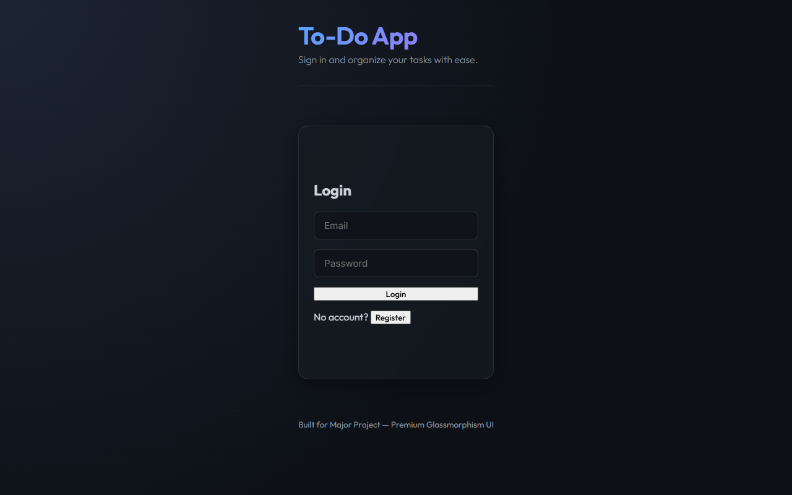
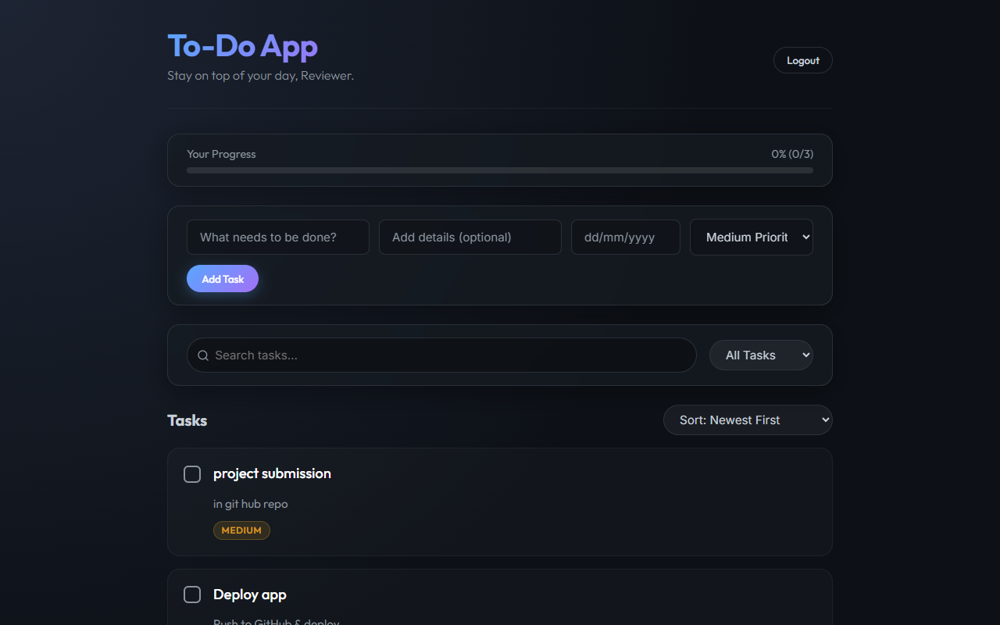
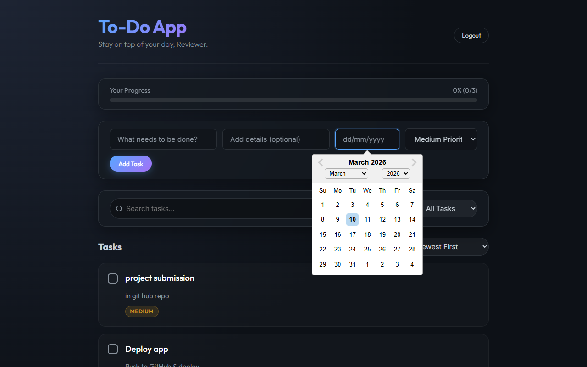
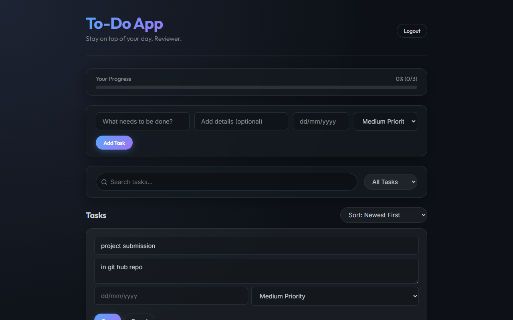
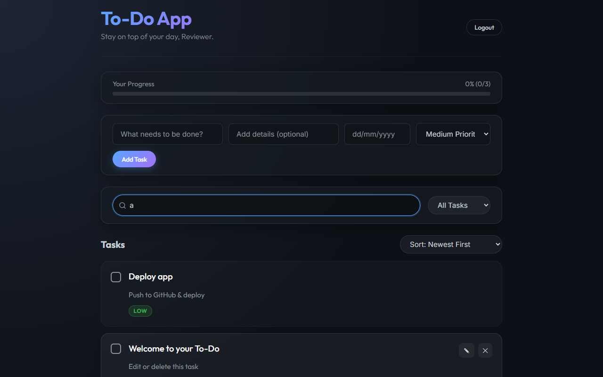

# 📝 Premium Full-Stack To-Do Application


A stunning, full-stack ToDo web application built with **React (frontend)** and **Node.js + Express (backend)**.  
It allows users to manage daily tasks — add, edit, delete, and mark tasks as completed — with real-time updates and secure authentication.

---

## 🚀 Features

- **Premium UI/UX:** Dark mode aesthetics with dynamic gradients, `backdrop-filter` glassmorphism, and sleek hover animations.
- **Advanced Date Tracking:** Native Day/Month/Year dropdown pickers mapped strictly to user locale contexts.
- **Smart Progress Tracker:** Automatic visual calculation of completed vs. internal tasks.
- **Priority Badging:** Dynamic color-coded visual tagging (`High`, `Medium`, `Low`).
- **Unified Full-Stack Service:** Express backend natively serves the compiled React production client, eliminating the need for dual dev servers!
- **Secure Authentication:** JWT-based user-specific task compartmentalization.

---

## 📸 Application Snapshots

### 1. Secure Authentication Login
A streamlined entry point that handles secure JWT handshakes.


### 2. Glassmorphism Dashboard
Dynamic blur mapping, interactive task checkboxes, and visual progress tracking.


### 3. Native Date Picker Flow
Complete interactive calendar floating smoothly above layered cards.


### 4. Interactive Edit Mode
In-place seamless task editing that instantly synchronizes forms with updated parameters.


### 5. Instant Filtering & Search
Live search filtering seamlessly connected to task states and keywords for quick retrieval.


---

## 🧩 Project Structure

```
todo-major-project/
│
├── client/              # React frontend (run `npm run build` here)
├── server/              # Node.js + Express backend (serves the client automatically)
├── docker-compose.yml   # Optional Docker setup
├── package.json
└── README.md
```

---

## ⚙️ Prerequisites

Before you start, make sure you have the following installed:

- [Node.js (v16 or higher)](https://nodejs.org/)
- npm (comes with Node)
- [MongoDB](https://www.mongodb.com/) running locally or cloud (Atlas)

---

## 🧠 Run Locally (Unified Production Setup)

You no longer need to run the client and server separately. The Express backend serves the React frontend cleanly.

### 1️⃣ Clone the repository
```bash
git clone https://github.com/Saisuman55/todo-major-project.git
cd todo-major-project/todo-major-project
```

### 2️⃣ Configure Backend Environment
Navigate to the `server` folder, create a `.env` file and add:
```env
PORT=5000
MONGO_URI=your_mongodb_connection_string
JWT_SECRET=your_super_secret_key_here
```

### 3️⃣ Build the Premium Frontend
Navigate to the `client/` directory and compile the React production build:
```bash
cd client
npm install
npm run build
```

### 4️⃣ Start the Backend
Navigate back to the `server/` directory, install dependencies, and run it:
```bash
cd ../server
npm install
npm run dev
```

**That's it!** Navigate to **http://localhost:5000** in your web browser. Express will automatically route your API requests securely and serve your beautiful React Client UI.

---

## 🌍 Deploy Live (Internet)

To host your full-stack MERN application for free on the public internet, we recommend **Render.com**. 

### 1️⃣ Set up MongoDB Atlas (Cloud Database)
1. Create a free account at [MongoDB Atlas](https://www.mongodb.com/atlas/database) and launch an **M0** (Free) cluster.
2. Under "Database Access", create a Database User with a password.
3. Under "Network Access", add IP address `0.0.0.0/0` (Allow from anywhere).
4. Click "Connect", choose "Connect your application", and copy the `MONGO_URI` connection string.

### 2️⃣ Deploy to Render.com
1. Go to [render.com](https://render.com) and log in with your GitHub account.
2. Click **New +** and select **Web Service**.
3. Connect your GitHub repository (`Saisuman55/todo-major-project`).
4. Configure the Web Service exactly like this:
   - **Environment:** `Node`
   - **Build Command:** `cd todo-major-project/client && npm install && npm run build && cd ../server && npm install`
   - **Start Command:** `cd todo-major-project/server && node server.js`
5. Click **Advanced** and add two **Environment Variables**:
   - `MONGO_URI` = *(Paste your connection string from Step 1)*
   - `JWT_SECRET` = `my_super_secret_key_123` *(Can be any secure random string)*
6. Click **Create Web Service**.

Your live URL will be ready in ~3 minutes (e.g., `https://todo-app-xyz.onrender.com`).

---

## 🔌 API Endpoints 

**Authentication**
- `POST /api/auth/register` — Requires `{ name, email, password }`
- `POST /api/auth/login` — Requires `{ email, password }` → Returns `{ token }`

**Tasks (Protected)**
- `GET /api/tasks` — Fetch user's tasks (optional `?filter=completed|pending`)
- `POST /api/tasks` — Create task `{ title, description, dueDate, priority }`
- `GET /api/tasks/:id` — Get one specific task
- `PUT /api/tasks/:id` — Update existing task
- `DELETE /api/tasks/:id` — Delete task

---

## 🧑‍💻 Author

**Sai Suman Samantaray**
📍 Khordha, Odisha, India
🔗 [GitHub](https://github.com/Saisuman55)

---

## 📜 License

This project is open-source and available under the [MIT License](LICENSE).
